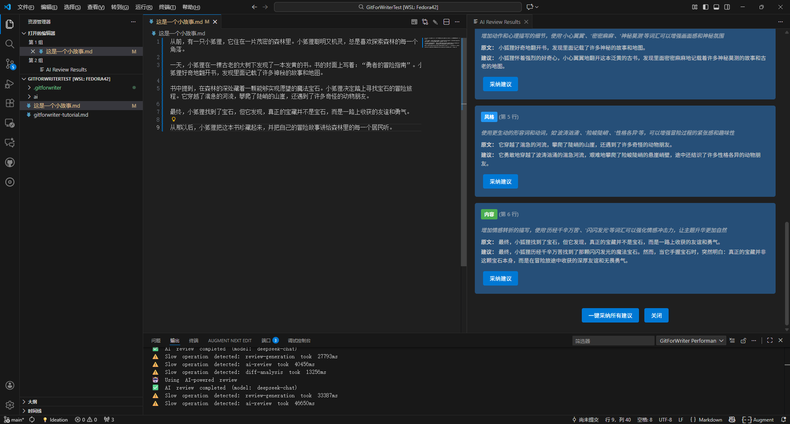
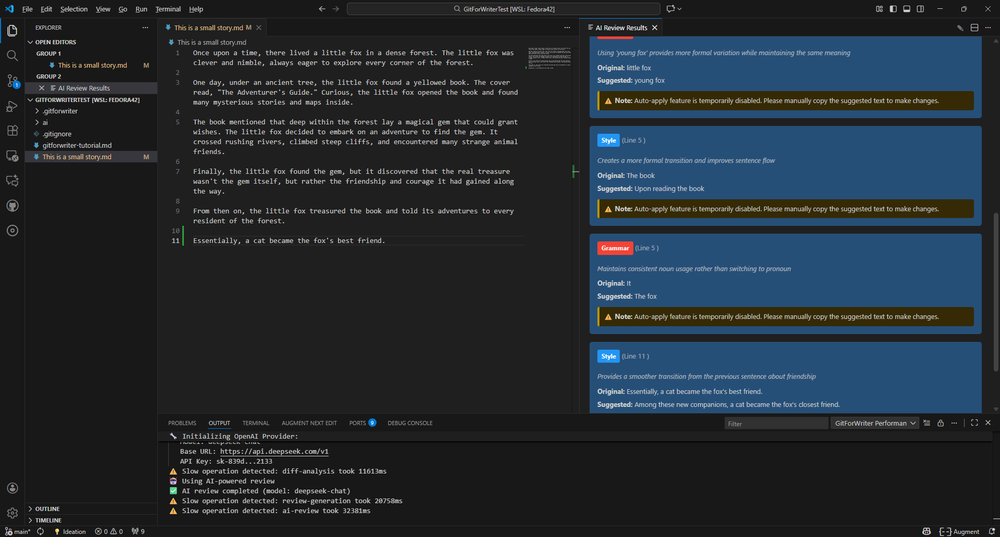

# GitForWriter

<div align="center">

[](https://github.com/ydzat/GitForWriter/actions/workflows/ci.yml)
[](https://www.gnu.org/licenses/agpl-3.0)
[](https://marketplace.visualstudio.com/items?itemName=ydzat.gitforwriter)

**让写作像编程一样严谨，像艺术一样自由**

[English](./README_EN.md) | 简体中文

</div>

---

## 📖 简介

GitForWriter 是一个 VSCode 扩展，将 **AI 智能审校**与 **Git 版本控制**完美结合，为 Markdown 和 LaTeX 写作提供专业的工作流支持。

### 核心理念

将软件工程的最佳实践应用到文学创作：
- 🔄 **版本控制** - 每次修改都有记录，可以回退到任何历史版本
- 🤖 **AI 审校** - 智能分析文本质量，提供专业的改进建议
- 📊 **可视化反馈** - 清晰展示修改历史和审校结果
- 🚀 **一键导出** - 支持 Markdown、LaTeX、PDF 多种格式

### 为什么选择 GitForWriter？

传统写作的痛点：
- ❌ 版本管理混乱（final.docx, final_v2.docx, final_final.docx...）
- ❌ 难以追踪修改历史
- ❌ 缺乏系统化的审校流程
- ❌ 协作困难

GitForWriter 的解决方案：
- ✅ Git 版本控制，每次修改都有记录
- ✅ AI 智能审校，自动发现问题并提供建议
- ✅ 可视化界面，清晰展示审校结果
- ✅ 多格式导出，满足不同发布需求

---

## ✨ 主要功能

### �� AI 智能审校

支持多种 AI 提供商：
- **OpenAI** (GPT-4, GPT-3.5-turbo)
- **Anthropic** (Claude 3 系列)
- **OpenAI 兼容 API** (DeepSeek, Qwen 等)
- **本地 LLM** (Ollama, LM Studio)

审校功能：
- 📊 **综合评分** - 0-10 分评价文本质量，透明的评分标准
- ✨ **优点识别** - 发现文本的亮点
- 📋 **改进建议** - 指出需要优化的地方
- 💡 **具体修改建议** - 提供可操作的改进方案（注：自动应用功能暂时禁用，请手动复制建议）

### 🌍 国际化支持

- 自动检测 VSCode 语言设置
- 支持中文和英文界面
- AI 审校结果自动匹配文档语言

### 📝 Git 版本管理

- 自动检测文件变化
- 生成差异记录（diff）
- 保存修改历史到 `.gitforwriter` 目录
- 可追溯的创作过程

### 📤 多格式导出

- **Markdown** - 保持原始格式
- **LaTeX** - 支持多种模板（default/academic/book/article）
- **PDF** - 完整的 LaTeX 编译流程
  - 自动检测编译器（pdflatex/xelatex/lualatex）
  - 多次编译支持（解析引用和目录）
  - 自动清理辅助文件
  - 编译完成后自动打开 PDF

### ⚡ 性能优化

- **AI 响应缓存** - 减少重复 API 调用，降低成本
- **文档保存防抖** - 避免频繁保存时的重复分析
- **性能监控** - 实时追踪操作性能


---

## 📸 截图

### 中文界面


### 英文界面


---

## 🚀 快速开始

### 安装

1. 在 VSCode 扩展市场搜索 "GitForWriter"
2. 点击安装
3. 重新加载 VSCode

或者从 VSIX 文件安装：
```bash
code --install-extension gitforwriter-1.0.0.vsix
```

### 配置 AI 提供商

1. 打开命令面板 (`Ctrl+Shift+P` 或 `Cmd+Shift+P`)
2. 运行 `GitForWriter: Configure AI Provider`
3. 选择你的 AI 提供商并配置 API Key

支持的提供商：
- **OpenAI** - 需要 OpenAI API Key
- **Anthropic** - 需要 Claude API Key  
- **OpenAI 兼容** - 支持 DeepSeek、Qwen 等（需要配置 baseURL 和 API Key）
- **本地 LLM** - 支持 Ollama、LM Studio 等

### 基本使用

1. **初始化项目**
   ```
   命令面板 → GitForWriter: Start Writing Project
   ```

2. **编写文档**
   - 创建或编辑 Markdown/LaTeX 文件
   - 每次保存时自动检测变化

3. **AI 审校**
   ```
   命令面板 → GitForWriter: AI Review
   ```

4. **导出文档**
   ```
   命令面板 → GitForWriter: Export Draft
   ```

---

## ⚙️ 配置选项

### AI 提供商配置

```json
{
  "gitforwriter.aiProvider": "openai",
  "gitforwriter.openai.model": "gpt-4",
  "gitforwriter.openai.baseURL": ""  // 可选：用于 DeepSeek 等兼容 API
}
```

### LaTeX/PDF 导出配置

```json
{
  "gitforwriter.latex.template": "default",
  "gitforwriter.latex.compiler": "pdflatex",
  "gitforwriter.latex.multiPass": true,
  "gitforwriter.latex.cleanAuxFiles": true,
  "gitforwriter.latex.openAfterCompile": true
}
```

### 性能优化配置

```json
{
  "gitforwriter.performance.debounceDelay": 2000,
  "gitforwriter.performance.enableCache": true,
  "gitforwriter.performance.cacheTTL": 3600000,
  "gitforwriter.performance.cacheMaxSize": 104857600
}
```

详细配置说明请参考 [INSTALL.md](./INSTALL.md)

---

## 📚 使用场景

- **小说创作** - 追踪情节发展，管理角色设定的演变
- **学术写作** - 论文多次修改的版本管理，导出符合期刊要求的格式
- **技术文档** - Markdown 文档的持续改进，自动检测文档一致性
- **博客写作** - 文章草稿的迭代优化，快速导出发布格式

---

## 🛠️ 技术栈

- **TypeScript** - 类型安全的开发体验
- **VSCode Extension API** - 深度集成 VSCode
- **Vercel AI SDK** - 统一访问 100+ LLM 模型
- **OpenAI SDK** - OpenAI 和兼容 API 支持
- **Anthropic SDK** - Claude 模型支持
- **simple-git** - Git 操作封装

---

## 🤝 贡献

欢迎贡献代码、报告问题或提出建议！

详细信息请参考 [CONTRIBUTING.md](./CONTRIBUTING.md)

---

## 📄 许可证

本项目采用 [AGPL-3.0 许可证](./LICENSE)

---

## 🔗 相关链接

- [GitHub 仓库](https://github.com/ydzat/GitForWriter)
- [问题反馈](https://github.com/ydzat/GitForWriter/issues)
- [更新日志](./CHANGELOG.md)
- [安装指南](./INSTALL.md)
- [使用示例](./EXAMPLE.md)
- [隐私政策](./PRIVACY.md)
- [安全政策](./SECURITY.md)

---

## 💬 反馈与支持

- 提交 Issue：[GitHub Issues](https://github.com/ydzat/GitForWriter/issues)
- 功能建议：欢迎在 Issues 中讨论

---

**GitForWriter** - 让写作像编程一样严谨，像艺术一样自由。

Made with ❤️ for writers who code and coders who write.
